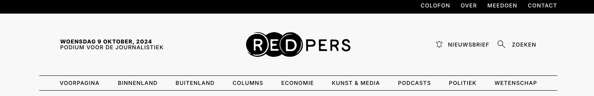
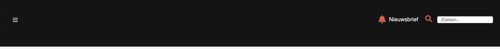
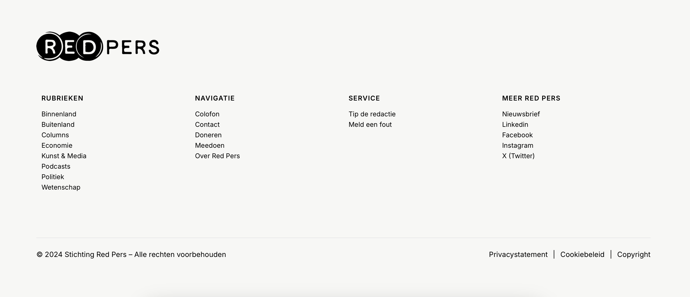
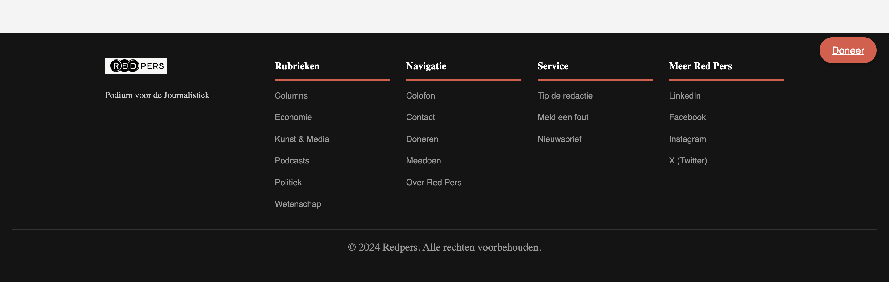

# 🌐 Accessible Website

Ontwerp en maak een toegankelijke component/pagina/site volgens de WCAG-richtlijnen voor een opdrachtgever.

📋 De instructie van deze leertaak staat in de [INSTRUCTIONS](https://github.com/fdnd-task/all-human-accessible-website/blob/main/docs/INSTRUCTIONS.md).

## 📑 Inhoudsopgave
- [Beschrijving](#beschrijving)
- [Kenmerken](#kenmerken)
- [Visuele Vergelijking](#visuele-vergelijking)
- [Bronnen](#bronnen)
- [Licentie](#licentie)

## ✨ Beschrijving
Dit project is uitgevoerd voor Red Pers, waar het verhaal van Amsterdamse polaroidfotografen centraal staat. Met verschillende verbeteringen zijn de toegankelijkheid, het contrast en de gebruiksvriendelijkheid aanzienlijk verbeterd.

### Wat heb ik aangepast?
- 🎨 **Dropdownmenu**: Een nieuw toegankelijk dropdownmenu in de navigatiebalk, zodat gebruikers eenvoudig door de site kunnen navigeren, zelfs op mobiele apparaten.
- 📊 **View-counter**: Een dynamische teller die bijhoudt hoe vaak een artikel is bekeken, opgeslagen in de browser via `localStorage`.

### Contrastverbeteringen:
- ⚫ **Navigatiebalk & Footer**: Beide zijn nu zwart-wit voor beter contrast, wat de leesbaarheid voor mensen met visuele beperkingen sterk verbetert.
- 🔴 **Donatieknoppen & Auteursectie**: De hoverkleur van knoppen is veranderd naar rood, wat duidelijker is en beter opvalt.

### Animaties & Visuele Effecten:
- 💫 **Hover-animaties**: Lichte animaties bij de tweede navigatiebalk en donatieknoppen voor een interactievere gebruikerservaring.
- 🔄 **Footer-animaties**: De tekstkleur verandert naar rood wanneer je over links in de footer gaat, wat zorgt voor betere feedback aan de gebruiker.

### Typografie & Witte Ruimte:
- 🔤 **Hierarchie**: Verschillende lettergroottes en typografie zijn toegepast voor een duidelijke teksthiërarchie.
- ⬜ **Witte Ruimte**: Meer witte ruimte toegevoegd voor een rustigere en overzichtelijke opmaak.

🌐 Bekijk de live versie op GitHub Pages [HIER](https://fatimahilali.github.io/all-human-accessible-website/).

## 🚀 Kenmerken
| Technologie  | Beschrijving |
|--------------|--------------|
| HTML         | Semantische elementen zoals `<header>`, `<section>`, `<footer>`. Toegankelijkheid verbeterd met een clean HTML-structuur. |
| CSS          | Flexbox voor een responsieve lay-out. Animaties en transitions voor visuele feedback (bijvoorbeeld hover-effecten). |
| JavaScript   | Functionaliteit voor dropdown-menu en view-counter. Voortgangsbalk voor artikel leesvoortgang. |

## 🔗 Visuele Vergelijking
### Navigatie
Voorgaande versie:

Huidige versie:

Verbetering: De nieuwe navigatie heeft een beter contrast (zwart-wit kleurenschema) en is volledig toegankelijk met toetsenbord en schermlezers.

### Footer
Voorgaande versie:

Huidige versie:

Verbetering: De nieuwe footer is voorzien van duidelijke links, verbeterde typografie en is responsief op zowel mobiele als desktopapparaten.

## 📚 Bronnen
- [Carrière maken als Amsterdamse polaroidfotograaf: ‘Soms is het een strijd om de nacht’](https://redpers.nl/2024/02/20/carriere-maken-als-amsterdamse-polaroidfotograaf-soms-is-het-een-strijd-om-de-nacht/)

## ⚖️ Licentie
Dit project is gelicenseerd onder de voorwaarden van de [MIT-licentie](./LICENSE).

